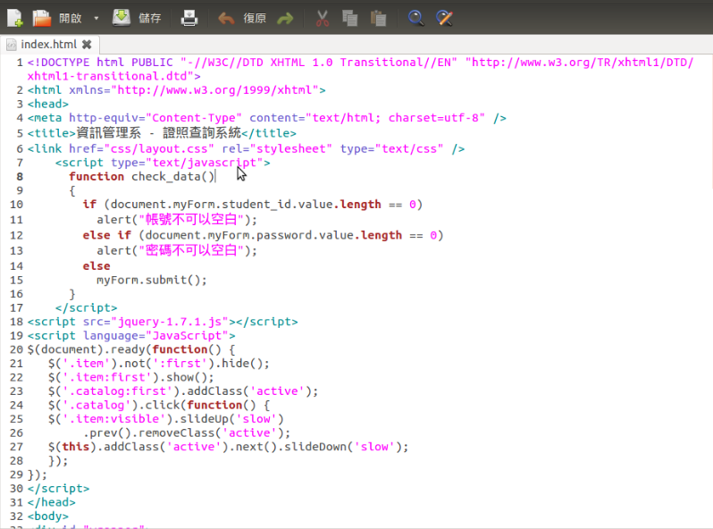
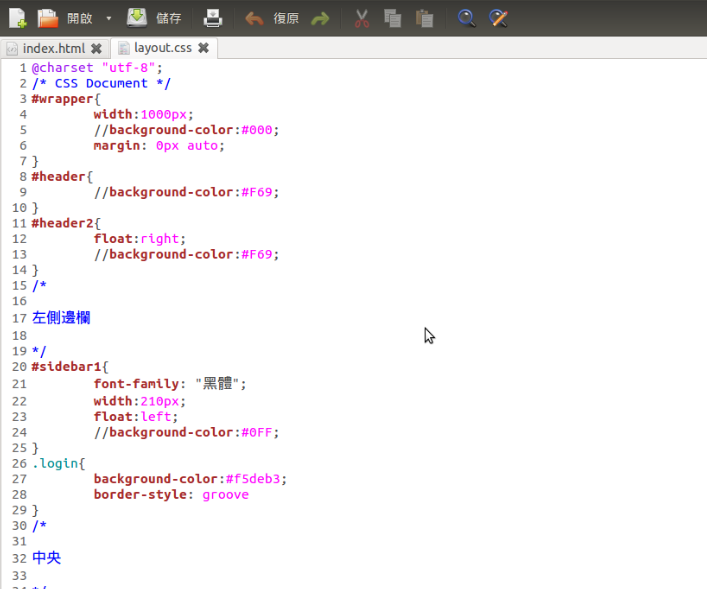

### 學生證照管理系統

* 指導老師：林慶昌
* 資三篤
    * 組長：陳信華 49951363
    * 組員：曹詩敏 49951308
    * 組員：黃柏崴 49951331
    * 組員：陳廉忠 49951329
    * 組員：林揚評 49951362

### 工作內容分配

### 程式撰寫、版面設計
### 文書處理、會議記錄

* 陳信華
* 曹詩敏
* 林揚評

## 資料庫建立、正規化

* 黃柏崴
* 陳廉忠

## 目錄

* 學生證照管理系統
* 目標
* 開發環境
* 結論
* 系統展示

## 學生證照管理系統

* 何謂學生證照管理系統？
* 為什麼要做這個？
* 需要有什麼樣的功能？

## 目標

* 希望達到的功能與效果
* 期望加入的功能
* 帶來的效果

## 開發環境
## 使用工具  
## A + P + M

## 呈現方式
## WEB

## HTML

## CSS

## 遭遇的困難

## 就是要學的東西太多了
## HTML
## CSS
## PHP
## JavaScript
## jQuery
## ...

## 好像漏了一樣東西, 想不起來

## 對了！ 
## 就是很多人被當的資料庫

#結論

## 雖然要學東西還很多
## 但是還來得及

# 未來發展

## 方便化
## 實用化
## 簡單化

# 系統展示
